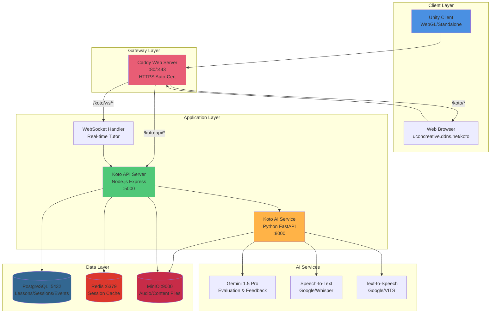
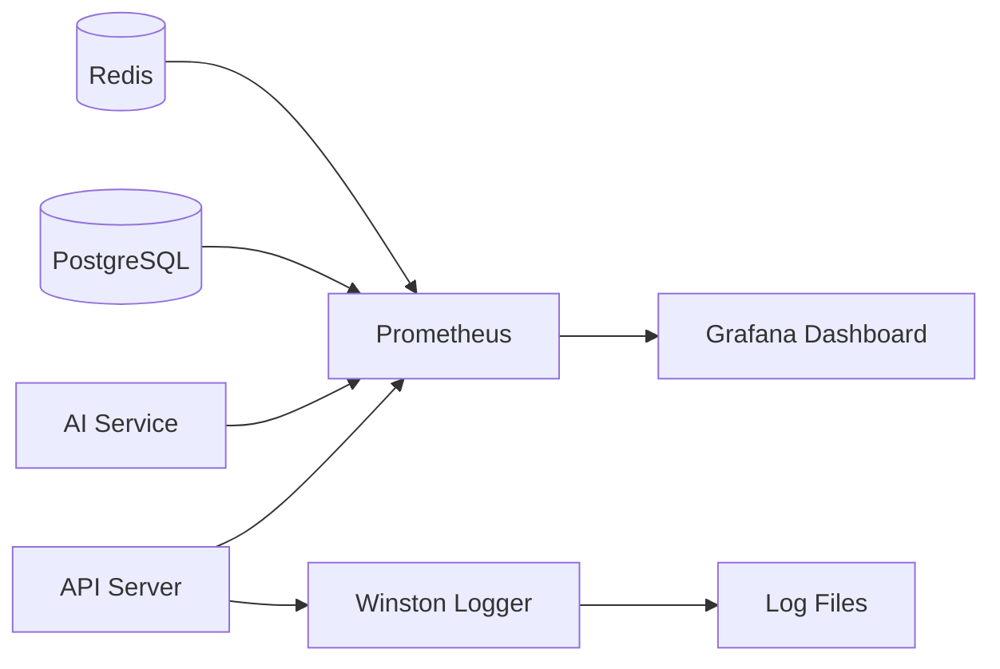

# Korean Together 시스템 아키텍처

## 1. 계층 구조 (Layered Architecture)

### Client Layer (클라이언트 계층)
- **Unity Client**: 메타버스 3D 환경, 아바타, 음성 입출력
- **Web Browser**: 관리자 콘솔, 진도 확인 (옵션)

### Gateway Layer (게이트웨이 계층)
- **Caddy**: 리버스 프록시, HTTPS 자동화, 라우팅

### Application Layer (애플리케이션 계층)
- **API Server**: 세션 관리, 레슨 오케스트레이션, 이벤트 로깅
- **AI Service**: 음성 인식, 평가, 피드백 생성, TTS
- **WebSocket**: 실시간 튜터-학습자 상호작용

### AI Services (AI 서비스 계층)
- **Gemini API**: 응답 평가, 오류 분석, 피드백 생성
- **STT**: 음성 → 텍스트 변환
- **TTS**: 텍스트 → 음성 변환

### Data Layer (데이터 계층)
- **PostgreSQL**: 구조화된 데이터 (레슨, 세션, 이벤트)
- **Redis**: 세션 캐시, 임시 데이터
- **MinIO**: 음성 파일, 콘텐츠 저장

---

## 2. 데이터 흐름 (Data Flow)

### 학습 세션 시작
```
Unity → Caddy → API → PostgreSQL
                    ↓
                WebSocket 연결
```

### 음성 입력 처리
```
Unity (Microphone) → WebSocket → API → AI Service
                                           ↓
                                    [STT] → Text
                                           ↓
                                    [Gemini] → Evaluation
                                           ↓
                                    [TTS] → Audio → MinIO
                                           ↓
                        ← WebSocket ← Response
                        ↓
Unity (Speaker + Subtitle)
```

### 진도 저장
```
API → PostgreSQL (session_events 테이블)
    → Redis (캐시 업데이트)
```

---

## 3. 보안 구조

```
Internet → Caddy (HTTPS) → Internal Network (localhost only)
                              ├─ API :5000
                              ├─ AI :8000
                              ├─ PostgreSQL :5432
                              └─ Redis :6379
```

**외부 노출**: 
- 80/443 (HTTPS only)
- 9000 (MinIO - 파일 서빙만)

**내부 전용**:
- 모든 DB 및 API 서버

---

## 4. 확장성 구조 (Scalability)

### Horizontal Scaling (수평 확장)
```
         Load Balancer
              |
    ┌─────────┼─────────┐
    ↓         ↓         ↓
  API-1    API-2    API-3
    └─────────┼─────────┘
              ↓
        Shared Database
```

### Regional Deployment (지역별 배포)
```
[Korea Server]      [Indonesia Server]    [Vietnam Server]
  - koto-kr.com       - koto-id.com          - koto-vn.com
  - Lang: ko-en       - Lang: ko-id          - Lang: ko-vi
  - DB: koto_kr       - DB: koto_id          - DB: koto_vn
              ↓              ↓                      ↓
                [Central Content Sync]
                [Model Update Distribution]
```

---

## 5. 개발 환경 vs 상용 환경

### Development (현재 서버)
```
Single Server: uconcreative.ddns.net
├─ All services in one machine
├─ Docker Compose
├─ PM2 process management
└─ /data/db/ local storage
```

### Production (Phase H2+)
```
Multi-Server Architecture:
├─ Web Tier (Caddy + API)
├─ AI Tier (GPU server)
├─ Data Tier (PostgreSQL + Redis + MinIO)
└─ CDN (Static assets)
```

---

## 6. 모니터링 구조 (Phase S5)



---

**문서 버전**: 1.0.0  
**최종 업데이트**: 2026-01-15  
**작성자**: Antigravity AI
